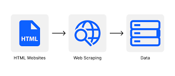

# **Country Leaders Scraper**

The Country Leaders Scraper is a Python script that collects information about country leaders from 'https://country-leaders.onrender.com'. It utilizes web scraping techniques to retrieve data on the leaders of different nations. Additionally, it scrapes the first paragraph from each leader's Wikipedia page. The scraper then saves all the retrieved data into a file named 'leaders.json'.

## Prerequisites
- Python 3.x
- Requests library (`pip install requests`)
- Beautiful Soup library (`pip install beautifulsoup4`)

## Usage/Installation
1. Clone the repository
2. Navigate to the project directory
3. Install the required dependencies 
'''shell
   pip install -r requirements.txt
4. Run the scraper

The scraper will commence scraping the website and gathering data. Upon completion, the data will be stored in the project directory as 'leaders.json'. 

## Timeline
This project was a significant learning curve, taking me three days to complete. 
